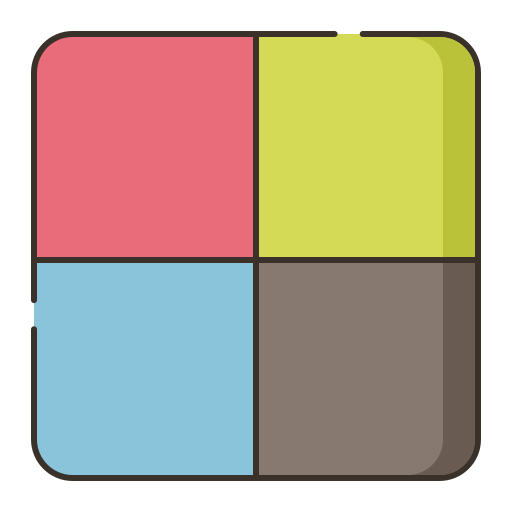

<!--
*** Thanks for checking out the Best-README-Template. If you have a suggestion
*** that would make this better, please fork the repo and create a pull request
*** or simply open an issue with the tag "enhancement".
*** Thanks again! Now go create something AMAZING! :D
-->

<!-- PROJECT SHIELDS -->
<!--
*** I'm using markdown "reference style" links for readability.
*** Reference links are enclosed in brackets [ ] instead of parentheses ( ).
*** See the bottom of this document for the declaration of the reference variables
*** for contributors-url, forks-url, etc. This is an optional, concise syntax you may use.
*** https://www.markdownguide.org/basic-syntax/#reference-style-links
-->

<!-- PROJECT LOGO -->
 

  

  <h3 align="center">Etch-a-Sketch</h3>

  

    An awesome README template to jumpstart your projects!
  

  <h3>
    <a target="_blank" href="https://bluechai03.github.io/etch-a-sketch/">
      Demo
    </a>
     | 
    <a target="_blank" href="https://github.com/Bluechai03/etch-a-sketch">
      Solution
    </a>
  </h3>
  

<!-- TABLE OF CONTENTS -->

  
Table of Contents

  <ol>
    <li>
      <a href="#about-the-project">About The Project</a>
      <ul>
        <li><a href="#built-with">Built With</a></li>
      </ul>
    </li>
    <li><a href="#license">License</a></li>
    <li><a href="#contact">Contact</a></li>
    <li><a href="#acknowledgements">Acknowledgements</a></li>
  </ol>

<!-- ABOUT THE PROJECT -->

## About The Project

[![Product Name Screen Shot][product-screenshot]](https://example.com)

There are many great README templates available on GitHub, however, I didn't find one that really suit my needs so I created this enhanced one. I want to create a README template so amazing that it'll be the last one you ever need -- I think this is it.

Here's why:

- Your time should be focused on creating something amazing. A project that solves a problem and helps others
- You shouldn't be doing the same tasks over and over like creating a README from scratch
- You should element DRY principles to the rest of your life :smile:

Of course, no one template will serve all projects since your needs may be different. So I'll be adding more in the near future. You may also suggest changes by forking this repo and creating a pull request or opening an issue. Thanks to all the people have have contributed to expanding this template!

A list of commonly used resources that I find helpful are listed in the acknowledgements.

### Built With

This section should list any major frameworks that you built your project using. Leave any add-ons/plugins for the acknowledgements section. Here are a few examples.

- [JavaScript]()
- [Bootstrap](https://getbootstrap.com)
- [JQuery](https://jquery.com)
- [Laravel](https://laravel.com)

<!-- LICENSE -->

## License

Distributed under the MIT License. See `LICENSE` for more information.

<!-- CONTACT -->

## Contact

Anna Montero - [Bluechai03](https://github.com/Bluechai03) - montero.katreena@gmail.com

Project Link: [https://github.com/Bluechai03/etch-a-sketch](https://github.com/Bluechai03/etch-a-sketch)

<!-- ACKNOWLEDGEMENTS -->

## Acknowledgements

- [Best-README-Template](https://github.com/othneildrew/Best-README-Template)
- [The Odin Project](https://connoratherton.com/loaders)
- [dom-to-image](https://www.webpagefx.com/tools/emoji-cheat-sheet)
- [FileSaver](https://github.com/cferdinandi/smooth-scroll)
- [Pickr](https://shields.io)
- [Font Joy](https://kenwheeler.github.io/slick)
- [Google Fonts](https://choosealicense.com)
- [Netlify](https://pages.github.com)
- [Github Pages](https://daneden.github.io/animate.css)
- [Coolors.co](https://github.com/cferdinandi/smooth-scroll)
- [Animated CSS Buttom](https://codepen.io/nikkk-me/pen/abvPjeG)
